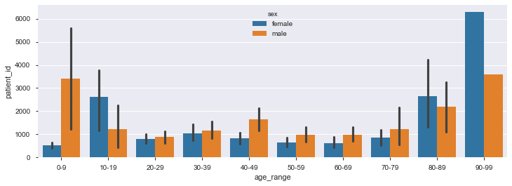
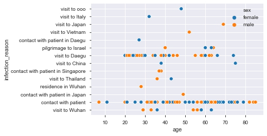
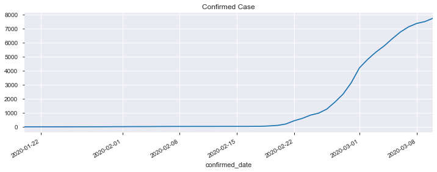
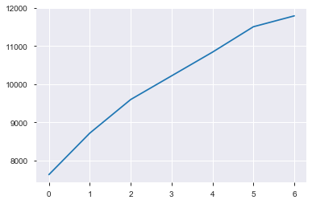

# PREDICT USING LONG SHORT TERM MEMORY (LSTM) MODELS
This repo for our Bangkit Academy Projects

## OBJECTIVES
### PROBLEM FRAMING
    The predicted growth of people infected from the number of positive indicated Coronavirus.
### HYPOTHESIS
    - How does the age range that affects infected coronavirus?
    - How does gender affect the number of people infected with coronavirus?
    - How many people will be infected by the coronavirus in the next seven days?
### FORMULATION
    Predicting using TensorFlow with Long Short-Term Memory (LSTM) Models
### PRESENTATION 
    This link for our slide presentation (http://bit.ly/LSTMcovid19)

## NOVEL CORONAVIRUS 2019 DATASET
Source : https://www.kaggle.com/larsupb/covid-19-forecast-germany-with-lgbm-and-keras/data

Day level information on covid-19 affected cases
Last Updated: 20-03-19 (Version 36 of 55)

### About this Dataset

#### Context

From World Health Organization - On 31 December 2019, WHO was alerted to several cases of pneumonia in Wuhan City, Hubei Province of China. The virus did not match any other known virus. This raised concern because when a virus is new, we do not know how it affects people.

So daily level information on the affected people can give some interesting insights when it is made available to the broader data science community.

Johns Hopkins University has made an excellent dashboard using the affected cases data. Data is extracted from the google sheets associated and made available here.

Edited: Now data is available as csv files in the Johns Hopkins Github repository. Please refer to the github repository for the Terms of Use details. Uploading it here for using it in Kaggle kernels and getting insights from the broader DS community.

#### Content

2019 Novel Coronavirus (2019-nCoV) is a virus (more specifically, a coronavirus) identified as the cause of an outbreak of respiratory illness first detected in Wuhan, China. Early on, many of the patients in the outbreak in Wuhan, China reportedly had some link to a large seafood and animal market, suggesting animal-to-person spread. However, a growing number of patients reportedly have not had exposure to animal markets, indicating person-to-person spread is occurring. At this time, it’s unclear how easily or sustainably this virus is spreading between people - CDC

This dataset has daily level information on the number of affected cases, deaths and recovery from 2019 novel coronavirus. Please note that this is a time series data and so the number of cases on any given day is the cumulative number.

The data is available from 22 Jan, 2020.

#### File Dataset

    patient.csv                 22 columns  (Main File)
    time.csv                    24 columns  
    route.csv                    7 columns
    case.csv                     8 columns
    trend.csv                    5 columns
    TotalCaseConvir_INA.csv      2 columns  (dataset file for country: Indonesia)

#### Acknowledgements

- Johns Hopkins University for making the data available for educational and academic research purposes
- MoBS lab - https://www.mobs-lab.org/2019ncov.html
- World Health Organization (WHO): https://www.who.int/
- DXY.cn. Pneumonia. 2020. http://3g.dxy.cn/newh5/view/pneumonia.
- BNO News: https://bnonews.com/index.php/2020/02/the-latest-coronavirus-cases/
- National Health Commission of the People’s Republic of China (NHC): http://www.nhc.gov.cn/xcs/yqtb/list_gzbd.shtml
- China CDC (CCDC): http://weekly.chinacdc.cn/news/TrackingtheEpidemic.htm
- Hong Kong Department of Health: https://www.chp.gov.hk/en/features/102465.html
- Macau Government: https://www.ssm.gov.mo/portal/
- Taiwan CDC: https://sites.google.com/cdc.gov.tw/2019ncov/taiwan?authuser=0
- US CDC: https://www.cdc.gov/coronavirus/2019-ncov/index.html
- Government of Canada: https://www.canada.ca/en/public-health/services/diseases/coronavirus.html
- Australia Government Department of Health: https://www.health.gov.au/news/coronavirus-update-at-a-glance
- European Centre for Disease Prevention and Control (ECDC): https://www.ecdc.europa.eu/en/geographical-distribution-2019-ncov-cases
- Ministry of Health Singapore (MOH): https://www.moh.gov.sg/covid-19
- Italy Ministry of Health: http://www.salute.gov.it/nuovocoronavirus

#### Inspiration

Some insights could be
- Changes in number of affected cases over time
- Change in cases over time at country level
- Latest number of affected cases

## METHODE
#### Data Preparation

The process of using domain knowledge to extract features from raw data via data mining techniques.

* Feature Selection
* Numerical Imputation
* Categorical Column Grouping
* Extracting column “age_range”
* Extracting date
* Data Profiling

#### Techniques

Long short-term memory (LSTM) is an artificial recurrent neural network (RNN) architecture used in the field of deep learning. Unlike standard feedforward neural networks, LSTM has feedback connections. It can not only process single data points (such as images), but also entire sequences of data (such as speech or video).

## RESULTS

People who are prone to coronavirus are old people and young people, especially older people from 80-99 years old. Based on this result, we conclude that older people more susceptible to coronavirus than younger people. And the number of Female patients is more than Male Patients.

____

The reason why people get infected by coronavirus. The most common things are direct contact with another patient and Visit to Daegu. Therefore, people who have not been exposed to coronavirus should keep their distance from coronavirus patients, and are requested for not to visit Daegu for a while.

_____

Graph of total coronavirus cases.

Based on the data, coronavirus began to spread by the end of February. Day after day, the case of coronavirus is apparently growing and more people are being affected.

____

Graph of Coronavirus prediction in the next 7 days

Based on the results we have made, the model predicted that for the next seven days the coronavirus will increase, even exceeding the ten thousand people affected by coronavirus. Based on this result, people should be more careful and take care of their health.

